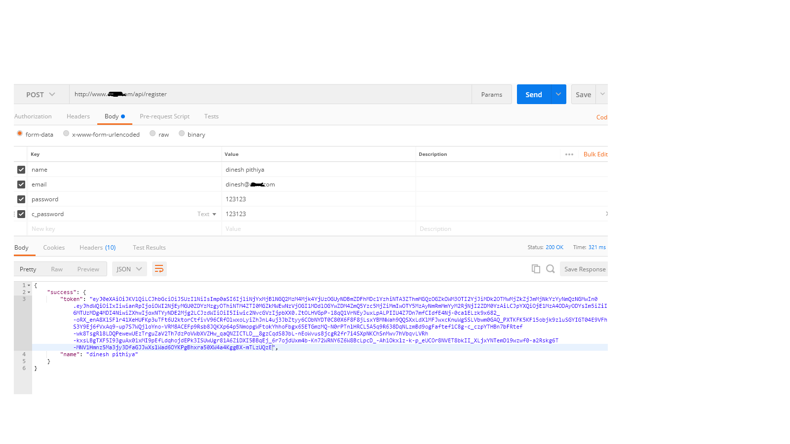
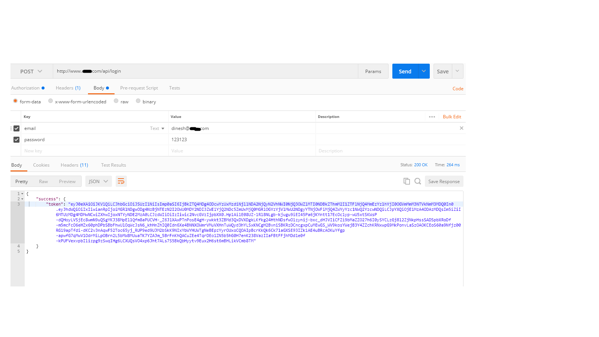
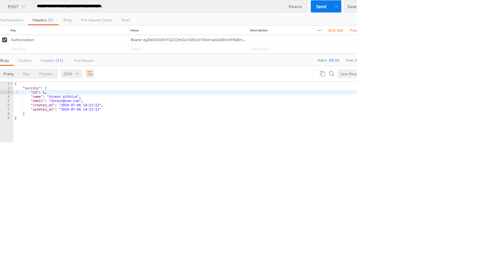

## You have to just follow few step to get following web services.

### Laravel version 5.5 LTS

1)Login API

2)Register API

3)Details API

> Step 1 : Install Laravel
```
composer create-project --prefer-dist laravel/laravel 5.5.* xyz-folder-name
```


> Step 2: Install Package
```
composer require laravel/passport=~4.0

```

> Step 3: Run Migration and Install
```
php artisan migrate

php artisan passport:install

```

After successfully install package, open config/app.php file and add service provider.
> config/app.php
```
'providers' => [

	....

	Laravel\Passport\PassportServiceProvider::class,

],

	....
```

> Configure passport model - Open app/User.php
```
namespace App;

use Illuminate\Notifications\Notifiable;
use Illuminate\Foundation\Auth\User as Authenticatable;
use Laravel\Passport\HasApiTokens;


class User extends Authenticatable
{
    use HasApiTokens, Notifiable;


    /**
     * The attributes that are mass assignable.
     *
     * @var array
     */
    protected $fillable = [
        'name', 'email', 'password',
    ];


    /**
     * The attributes that should be hidden for arrays.
     *
     * @var array
     */
    protected $hidden = [
        'password', 'remember_token',
    ];
}

```
Create controller
> app/Providers/AuthServiceProvider.php
```
<?php
namespace App\Providers;

use Laravel\Passport\Passport;
use Illuminate\Support\Facades\Gate;
use Illuminate\Foundation\Support\Providers\AuthServiceProvider as ServiceProvider;


class AuthServiceProvider extends ServiceProvider
{
    /**
     * The policy mappings for the application.
     *
     * @var array
     */
    protected $policies = [
        'App\Model' => 'App\Policies\ModelPolicy',
    ];


    /**
     * Register any authentication / authorization services.
     *
     * @return void
     */
    public function boot()
    {
        $this->registerPolicies();
        Passport::routes();
    }
}
```

> config/auth.php
```
<?php


return [
    .....
    'guards' => [
        'web' => [
            'driver' => 'session',
            'provider' => 'users',
        ],
        'api' => [
            'driver' => 'passport',
            'provider' => 'users',
        ],
    ],
    .....
]
```

> Step 5: Create API Route - routes/api.php
```
<?php
/*
|--------------------------------------------------------------------------
| API Routes
|--------------------------------------------------------------------------
|
| Here is where you can register API routes for your application. These
| routes are loaded by the RouteServiceProvider within a group which

 
| is assigned the "api" middleware group. Enjoy building your API!
|
*/

Auth::routes();
Route::post('login', 'API\UserController@login');
Route::post('register', 'API\UserController@register');


Route::group(['middleware' => 'auth:api'], function(){
	Route::post('details', 'API\UserController@details');
});
```

> Step 6: Create Controller
```
php artisan make:controller Api/UserController
```
app/Http/Controllers/Api/UserController.php
```
<?php

namespace App\Http\Controllers\Api;

use Illuminate\Http\Request;
use App\Http\Controllers\Controller;

use App\User;
use Illuminate\Support\Facades\Auth;
use Validator;

class UserController extends Controller
{
   public $successStatus = 200;
   /**
     * login api
     *
     * @return \Illuminate\Http\Response
     */
    public function login(){
        if(Auth::attempt(['email' => request('email'), 'password' => request('password')])){
            $user = Auth::user();
            $success['token'] =  $user->createToken('MyApp')->accessToken;
            return response()->json(['success' => $success], $this->successStatus);
        }
        else{
            return response()->json(['error'=>'Unauthorised'], 401);
        }
    }


    /**
     * Register api
     *
     * @return \Illuminate\Http\Response
     */
    public function register(Request $request)
    {
        $validator = Validator::make($request->all(), [
            'name' => 'required',
            'email' => 'required|email',
            'password' => 'required',
            'c_password' => 'required|same:password',
        ]);


        if ($validator->fails()) {
            return response()->json(['error'=>$validator->errors()], 401);            
        }


        $input = $request->all();
        $input['password'] = bcrypt($input['password']);
        $user = User::create($input);
        $success['token'] =  $user->createToken('MyApp')->accessToken;
        $success['name'] =  $user->name;


        return response()->json(['success'=>$success], $this->successStatus);
    }


    /**
     * details api
     *
     * @return \Illuminate\Http\Response
     */
    public function details()
    {
        $user = Auth::user();
        return response()->json(['success' => $user], $this->successStatus);
    }
}
```
> Now start laravel server and perform action
```
php artisan serve
```

> Registration


> Login


> Get detail
```
'headers' => [

    'Accept' => 'application/json',

    'Authorization' => 'Bearer '.$accessToken,

]
```


More detail go with 